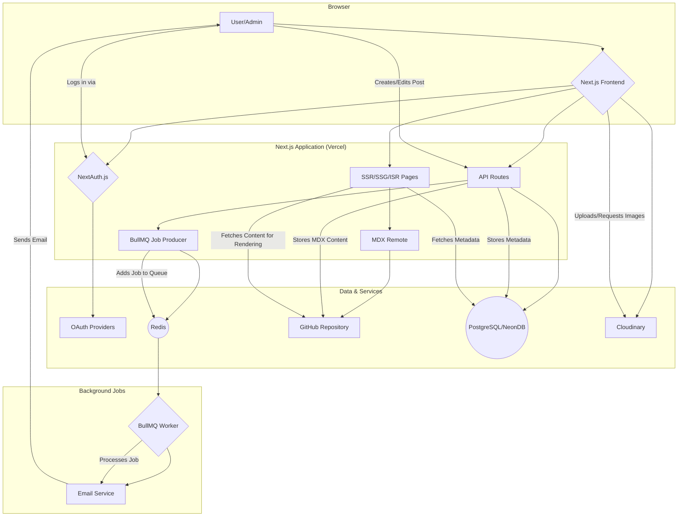

# MDX-Blog (Scribere)

-	A web application where where user (admins) can create blog using MDX (rich markdown format) with custom components.  
-	Supports Oauth2 authentication using Github and Google providers (Auth.js)
-	Applied different rendering strategies  with client and server components composition like SSR,SSG,ISR.
-	Improved performance and security using  Nextjs’s Server Actions to offload intensive and sensitive operations to server .
-	Integrated services  like  Github repository as storage for storing mdx files,Cloudinary for images etc.
-	Implemented a live MDX Editor  with custom components supporting re-rendering of mdx (on error) on the fly using React error boundaries
-	Redis cache for storing blur(image optimization on server using plaiceholder) and executing jobs (mailing,logs) with cron jobs.

# Architecture (Legacy)



## Getting Started

```bashd
npm run dev
# or
yarn dev
# or
pnpm dev
# or
bun dev
```


768-bb9e-e5f6dda70656">


